<!-- ================================================================ -->
<!--                        PREMIUM SVG BANNER                        -->
<!-- ================================================================ -->
<div align="center">
  
</div>

<!-- ================================================================ -->
<!--                    JAVA FULL STACK HEADER                       -->
<!-- ================================================================ -->

<div align="center">

  <!-- Typing Animation -->
  <a href="https://git.io/typing-svg">
    
  </a>

  <br/><br/>

  <!-- Social Links -->
  <a href="https://www.linkedin.com/in/aruna-kumar-gouda-3997b9359/">
    
  </a>

  <a href="mailto:arunakumargouda86@gmail.com">
    
  </a>

  <a href="https://github.com/ArunaKumarGouda">
    
  </a>

  <br/><br/>

  <!-- Profile Metrics -->
  
  
  


</div>

<!-- ================================================================ -->

<!--                         ABOUT ME                                -->

<!-- ================================================================ -->

<h2 align="center">🧠 About Me</h2>

<br>

<div align="center">

<p>
  
  
  
</p>

</div>

<br>

<div align="center">

<h3>👋 Hello, I'm Aruna Kumar Gouda</h3>

<p>
  I'm a <b>B.Tech Computer Science & Engineering student</b> with a strong
  interest in software development and building practical applications.
</p>

<p>
  I enjoy understanding how different parts of a software system work together —
  from <b>user interfaces and APIs to backend logic and databases</b>.
</p>

<p>
  I like learning by building, experimenting with new ideas, and turning
  concepts into working projects.
</p>

</div>

<br>

<p align="center">
  <b>💡 Learn</b>
  &nbsp;&nbsp;•&nbsp;&nbsp;
  <b>🛠️ Build</b>
  &nbsp;&nbsp;•&nbsp;&nbsp;
  <b>🧠 Solve</b>
  &nbsp;&nbsp;•&nbsp;&nbsp;
  <b>🚀 Grow</b>
</p>

<br>

<p align="center">
  <i>
    "Building skills one project, one problem, and one line of code at a time."
  </i>
</p>


<!-- ================================================================ -->
<!--                         TECH STACK                              -->
<!-- ================================================================ -->

<h2 align="center">⚡ Tech Stack</h2>

<p align="center">
  Technologies I use for Java Full Stack Development
</p>

<table align="center">
<tr>

<td width="25%" align="center">

<h3>🎨 Frontend</h3>


<br><br>

HTML · CSS · JavaScript · React

</td>

<td width="25%" align="center">

<h3>☕ Backend</h3>


<br><br>

Java · Spring Boot · REST API

</td>

<td width="25%" align="center">

<h3>🗄️ Database</h3>


<br><br>

MySQL · SQL · JPA · Hibernate

</td>

<td width="25%" align="center">

<h3>🛠️ Tools</h3>


<br><br>

Git · GitHub · Maven · Postman

</td>

</tr>
</table>

<br>

<p align="center">
  <b>React → REST API → Spring Boot → JPA / Hibernate → MySQL</b>
</p>


<!-- ================================================================ -->
<!--                         CURRENT FOCUS                           -->
<!-- ================================================================ -->

<h2 align="center">🎯 Current Focus</h2>

<p align="center">
  <i>Where I am today &nbsp; • &nbsp; Where I'm heading next</i>
</p>

<br>

<div align="center">

<p>
  
  &nbsp;&nbsp;&nbsp;&nbsp;&nbsp;&nbsp;
  
</p>

</div>

<br>

<div align="center">

<table border="0">
<tr>

<td width="45%" valign="top" align="left">

<h3>⚡ NOW</h3>

<p>
<b>🛠️ Building</b>
<br>
Real-world Java applications and full-stack projects
</p>

<p>
<b>🌱 Learning</b>
<br>
Spring Boot, REST APIs, JPA & Hibernate
</p>

<p>
<b>🧠 Practicing</b>
<br>
DSA, problem solving and coding challenges
</p>

<p>
<b>🎨 Developing</b>
<br>
React interfaces connected with backend APIs
</p>

</td>

<td width="10%" align="center">

<h1>│</h1>
<h1>│</h1>
<h1>│</h1>
<h1>│</h1>

</td>

<td width="45%" valign="top" align="left">

<h3>🚀 NEXT</h3>

<p>
<b>🔗 Full Stack Integration</b>
<br>
Connecting frontend, backend and database into complete applications
</p>

<p>
<b>🏗️ Better Architecture</b>
<br>
Writing cleaner, scalable and maintainable code
</p>

<p>
<b>💼 Placement Ready</b>
<br>
Strengthening technical and interview skills
</p>

<p>
<b>📈 Continuous Growth</b>
<br>
Turning projects and practice into real development experience
</p>

</td>

</tr>
</table>

</div>

<br>

<p align="center">
  
  →
  
  →
  
  →
  
</p>


<!-- ================================================================ -->
<!--                        FEATURED PROJECTS                         -->
<!-- ================================================================ -->
## 🚀 Featured Projects

<table>
<tr>
<td width="50%" valign="top">

### 🛡️ PathGuard
Smart route safety & path monitoring solution focused on reliability and real-time awareness.

`Java` `Spring Boot` `MySQL`

**Status:** 🟢 Active Development

[](https://github.com/ArunaKumarGouda)

</td>
<td width="50%" valign="top">

### 🚌 SmartBus Tracker
Real-time bus tracking system designed to bring live location awareness to daily commuters.

`Java` `React` `APIs`

**Status:** 🟢 Active Development

[](https://github.com/ArunaKumarGouda)

</td>
</tr>
<tr>
<td width="50%" valign="top">

### 🔐 File Encryption System
Secure file encryption/decryption tool built to protect sensitive data with strong cryptographic practices.

`Java` `Security` `Algorithms`

**Status:** 🟢 Stable

[](https://github.com/ArunaKumarGouda)

</td>
<td width="50%" valign="top">

### 🌐 Spring Boot APIs
Collection of production-style REST APIs demonstrating clean architecture and best practices.

`Spring Boot` `REST` `MySQL`

**Status:** 🟢 Growing Collection

[](https://github.com/ArunaKumarGouda)

</td>
</tr>
<tr>
<td width="50%" valign="top">

### ⚛️ React Projects
Frontend applications exploring component-driven design, state management, and modern UI patterns.

`React` `JavaScript` `CSS`

**Status:** 🟢 Ongoing

[](https://github.com/ArunaKumarGouda)

</td>
<td width="50%" valign="top">

### 🐍 Python Projects
Assorted Python scripts and mini-applications exploring automation, data handling, and AI fundamentals.

`Python` `Automation` `AI`

**Status:** 🟢 Ongoing

[](https://github.com/ArunaKumarGouda)

</td>
</tr>
<tr>
<td width="50%" valign="top">

### ☕ Java Projects
Core and advanced Java projects covering OOP design, data structures, and algorithmic problem-solving.

`Java` `DSA` `OOP`

**Status:** 🟢 Ongoing

[](https://github.com/ArunaKumarGouda)

</td>
<td width="50%" valign="top">

</td>
</tr>
</table>

<!-- ================================================================ -->
<!--                      📊 GITHUB ANALYTICS                         -->
<!-- ================================================================ -->

<h2 align="center">📊 GitHub Analytics</h2>

<p align="center">
  <i>Tracking my coding journey, contributions, and development activity.</i>
</p>

<br>

<p align="center">
  
  
</p>

<br>

<p align="center">
  
</p>

<br>

<p align="center">
  
</p>

<br>

<h3 align="center">🏆 GitHub Achievements</h3>

<p align="center">
  
</p>

<br>

<h3 align="center">🐍 Contribution Snake</h3>

<p align="center">
  
</p>

<h3 align="center">📈 GitHub Summary</h3>

<p align="center">

</p>

<p align="center">


</p>

<!-- ================================================================ -->
<!--                        CODING ACTIVITY                           -->
<!-- ================================================================ -->
## 💻 Coding Activity

<div align="center">

| Platform | Status |
|---|---|
| ⏱️ WakaTime | *Coming soon — integrate via wakatime README stats* |
| 📰 daily.dev | *Coming soon* |
| 🟧 LeetCode | *Coming soon* |
| 🔵 Codeforces | *Coming soon* |
| 🟢 GeeksforGeeks | *Coming soon* |
| 🟩 HackerRank | *Coming soon* |
| ⚫ CodeChef | *Coming soon* |

</div>

<!-- ================================================================ -->
<!--                          ACHIEVEMENTS                             -->
<!-- ================================================================ -->
## 🏆 Achievements

<p align="center">
  
  
  
  
</p>

<!-- ================================================================ -->
<!--                          CERTIFICATIONS                          -->
<!-- ================================================================ -->
## 🎓 Certifications

<table>
<tr>
<td align="center" width="33%">
🏅<br/><b>Java Programming</b><br/><sub>Add certificate link</sub>
</td>
<td align="center" width="33%">
🏅<br/><b>Python for Everybody</b><br/><sub>Add certificate link</sub>
</td>
<td align="center" width="33%">
🏅<br/><b>Web Development</b><br/><sub>Add certificate link</sub>
</td>
</tr>
</table>

<!-- ================================================================ -->
<!--                             TIMELINE                             -->
<!-- ================================================================ -->
## 🗺️ Learning Journey & Timeline

```text
2022  ●─── Started B.Tech in Computer Science Engineering
2023  ●─── Learned Java, C, and core programming fundamentals
2024  ●─── Explored Python, Web Development (HTML/CSS/JS), MySQL
2025  ●─── Built Spring Boot APIs, React apps & real-world projects
2026  ●─── Diving into Microservices, Docker, Cloud & Machine Learning
Next  ●─── Placement-ready Full Stack + AI-powered projects
```

<!-- ================================================================ -->
<!--                       DEVELOPMENT ROADMAP                        -->
<!-- ================================================================ -->
## 🛤️ Development Roadmap

- [x] Java & Core Programming
- [x] Spring Boot Fundamentals
- [x] React & Frontend Development
- [ ] Microservices Architecture
- [ ] Docker & Containerization
- [ ] AWS Cloud Fundamentals
- [ ] Kubernetes
- [ ] Machine Learning & Deep Learning
- [ ] Data Science Foundations

<!-- ================================================================ -->
<!--                          QUOTE SECTION                           -->
<!-- ================================================================ -->
<div align="center">

### 💬


</div>

<!-- ================================================================ -->
<!--                            FUN SECTION                            -->
<!-- ================================================================ -->
## 🎉 Just for Fun

<div align="center">
  
</div>

<sub>🗺️ Visitor map & 🎧 Spotify status — placeholders ready to connect once configured.</sub>

<!-- ================================================================ -->
<!--                          SUPPORT SECTION                          -->
<!-- ================================================================ -->
## 🤝 Let's Connect

<div align="center">

[](mailto:arunakumargouda86@gmail.com)
[](https://www.linkedin.com/in/aruna-kumar-gouda-3997b9359/)
[](https://github.com/ArunaKumarGouda)

*Always open to collaborating on interesting projects, open source, and new ideas.*

</div>

<!-- ================================================================ -->
<!--                            FOOTER                                 -->
<!-- ================================================================ -->
<div align="center">
  
</div>
